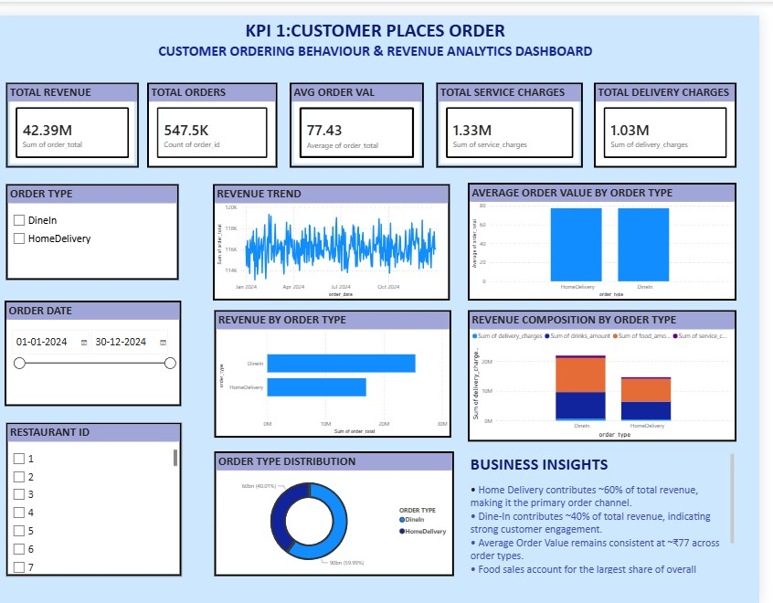
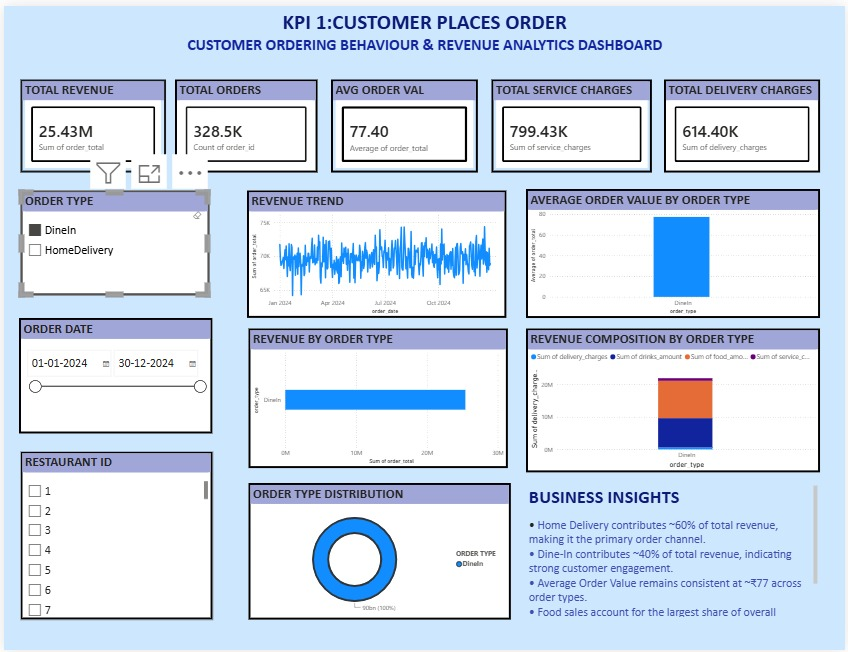
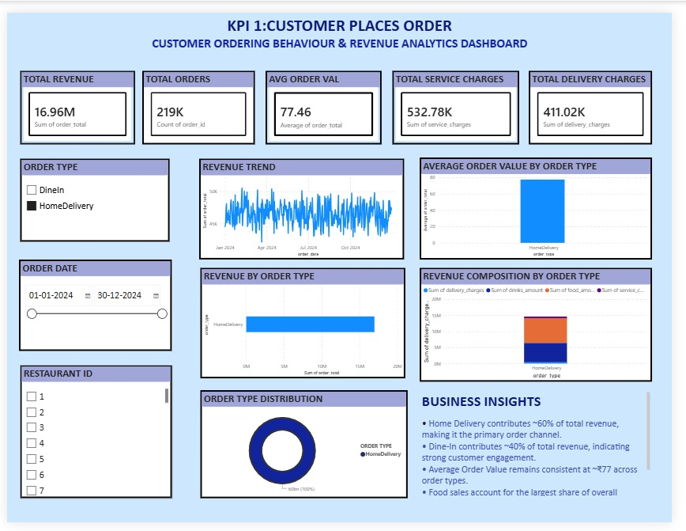

# Customer Ordering Behaviour & Revenue Analytics

A Power BI dashboard analysing 547K+ orders and ₹42M in revenue 
across Dine-In and Home Delivery channels for 2024.

## Key Insights
- Home Delivery accounts for ~60% of total revenue
- Dine-In drives ~40% — strong in-store engagement
- Average Order Value is consistent at ₹77 across both order types
- Food sales account for the largest share of overall revenue

## Tools Used
Power BI · DAX · Data Cleaning

## Dashboard Views

### Default View

### Dine In Filter Applied

### Home Delivery Filter Applied

